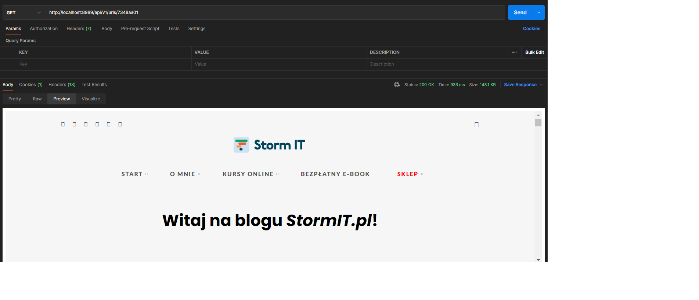

[Angielski](README.md) - [<ins>Polski</ins>](README.pl.md)

# Aplikacja TinyUrl
TinyUrl – aplikacja, która zamienia pełen, długi adres URL na skróconą formę.

## Spis treści
* [Informacje ogólne](#informacje-ogólne)
* [Zastosowane technologie](#zastosowane-technologie)
* [Zrzuty ekranu](#zrzuty-ekranu)
* [Wymagane aplikacje/narzędzia](#wymagane-aplikacje-narzedzia)
* [Autorzy](#autorzy)

## Informacje ogólne
Projekt ma na celu praktyczną naukę, wdrążenia wiedzy pozyskanej w kursach Tomasza Wolińskiego - JOP (Java Od Podstaw) oraz EAI (Efektywne Aplikacje Internetowe).
Tworzona aplikacja służy do zamiany długiego adresu URL podanego przez użytkownika na skróconą formę (wzorowana na takich platformach jak m.in.: Bitly.com, Rebrandly.com, TinyURL.com).
Aplikacja jest oparta na architekturze REST i modelu Minimum Viable Product (MVP).

## Zastosowane technologie
### Development
- [Java 18](https://openjdk.org/projects/jdk/18/)
- [Spring Boot 2](https://spring.io/projects/spring-boot)
- [Spring Data](https://spring.io/projects/spring-data)
- [PostgreSQL (docker)](https://www.postgresql.org/)
- [Maven 3.x](https://maven.apache.org/)
- [Git](https://git-scm.com/)

### Testy
- [JUnit5](https://junit.org/junit5/)
- [Mockito](https://site.mockito.org/)

## Zrzuty ekranu

## Wymagane aplikacje/narzędzia
Do uruchomienia aplikacji wymagana jest instalacja następujących narzędzi:

- [IntelliJ IDEA](https://www.jetbrains.com/idea/),
- [Java 18](https://openjdk.org/projects/jdk/18/)
- [Maven 3.x](https://maven.apache.org/download.cgi),
- [Docker](https://docs.docker.com/get-docker/)

## Autorzy
Społeczność StormIT:
- bartek.karp93@gmail.com
- robertojavadev@gmail.com